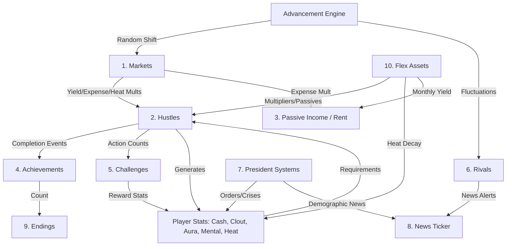

# Bag Chaser: System Interaction Audit

This document outlines the current state of the Bag Chaser game systems, their interconnections, and proposed deepening of these interactions to enhance gameplay depth and replayability.

---

## 1. System Map (Current State)

---

## 2. Detailed System Analysis

### 1. Markets (`marketConfig.ts`, `advancementEngine.ts`)
*   **A. Inputs**: Random seed (15% monthly shift chance), `AdvancementEngine` logic.
*   **B. Outputs**: Yield/Expense/Heat multipliers (e.g., Recession = 0.5x yield, 1.5x expense).
*   **C. Current Interactions**: Scales `Hustles` and `Passive Income`. Affects `Rent`.
*   **D. Potential Interactions**: Could be influenced by `Rival` market-cornering or `Presidential` economic policy (QE).

### 2. Hustles (`hustles/base.ts`, `hustleEngine.ts`)
*   **A. Inputs**: Player Stats (requirements), Market Multipliers, Minigame Performance.
*   **B. Outputs**: Stat Deltas (Cash, Clout, Aura, Mental, Heat), Mastery progress.
*   **C. Current Interactions**: Triggers `Achievements` and `Challenges`. Logs to `News`.
*   **D. Potential Interactions**: Could be influenced by `News` sentiment (Hype/FUD) and `Rival` competition (Cost increases).

### 3. Passive Income (`advancementEngine.ts`, `playerStats`)
*   **A. Inputs**: Hustle Levels, `FlexAssets`, Real Estate, Vending Machines, Artists.
*   **B. Outputs**: Monthly Cash delta.
*   **C. Current Interactions**: Integrated into `AdvancementEngine` monthly tick.
*   **D. Potential Interactions**: Could be hit by sector-specific market cycles (e.g., a "Real Estate Bust" hitting RE passives specifically).

### 4. Achievements (`achievement system`)
*   **A. Inputs**: `GameEvent` logs, State changes (Total earnings, Mastery).
*   **B. Outputs**: Stat rewards, Legacy Points.
*   **C. Current Interactions**: Contributes to `Endings` score and `Legacy` multipliers.
*   **D. Potential Interactions**: Could gate specific `Ending` narratives (e.g., need "Philanthropy Mastery" for a specific good ending).

### 5. Challenges (`challenge system`)
*   **A. Inputs**: Daily login, Hustle execution counts.
*   **B. Outputs**: Stat rewards (Cash, Aura, Clout).
*   **C. Current Interactions**: Updates `PlayerStats`.
*   **D. Potential Interactions**: Could feed into a permanent `Legacy` momentum buff (e.g., +0.1% yield per 10 challenges completed).

### 6. Rivals (`rivals.ts`, `rival system`)
*   **A. Inputs**: Monthly tick (random wealth fluctuation).
*   **B. Outputs**: News ticker strings, Net worth updates.
*   **C. Current Interactions**: Visual only. Alerts player to "Aggressive Bidding."
*   **D. Potential Interactions**: Should mechanically increase `Hustle Costs` if the player is being outpaced (Market Cornering).

### 7. President Systems (`presidentEngine.ts`, `PresidentDashboard`)
*   **A. Inputs**: Executive Orders, Crisis resolutions, Monthly ticks.
*   **B. Outputs**: Approval ratings, Demographic shifts, News.
*   **C. Current Interactions**: Modifies stats and logs news.
*   **D. Potential Interactions**: Executive Orders should be able to force `MarketType` changes (e.g., Quantitative Easing = Bull Market).

### 8. News (`news ticker`)
*   **A. Inputs**: Engine events, Market shifts, Rival updates.
*   **B. Outputs**: Ticker UI messages.
*   **C. Current Interactions**: Visual log of state changes.
*   **D. Potential Interactions**: Should apply "Sentiment Multipliers" (Hype/FUD) to specific hustle yields for 3–6 months.

### 9. Endings (`endings.ts`)
*   **A. Inputs**: Tier reached, Legacy score, Dominant stats.
*   **B. Outputs**: Narrative conclusion modal.
*   **C. Current Interactions**: Terminal point of a run.
*   **D. Potential Interactions**: Could be gated by `Achievement` categories or `Presidential` diary outcomes.

### 10. Flex Assets (`flexAssets.ts`)
*   **A. Inputs**: Cash purchase.
*   **B. Outputs**: Passive yield, Stat gain bonuses, Heat decay bonuses.
*   **C. Current Interactions**: Global multipliers on hustle yields and mental recovery.
*   **D. Potential Interactions**: High-tier assets could trigger unique `News` events or `Rival` retaliations.

---

## 3. Isolated Systems & Multi-System Influence Proposals

The following systems are currently "functional silos." Below are proposals for how each can influence at least TWO other major systems:

### 1. Rivals
*   **Influence A (Markets)**: **Sector Monopoly**. If a Rival’s net worth exceeds 10x the player's, they can force a `RECESSION` or `CRACKDOWN` specifically in the player's tier, simulating a hostile regulatory environment.
*   **Influence B (Hustles)**: **Market Cornering**. Dominant rivals increase the `cost` of all active hustles in their tier by 25% due to competitive pressure on resources.
*   **Influence C (Flex Assets)**: **Asset Bidding**. Rivals occasionally "outbid" the player for high-tier Flex Assets, temporarily increasing their cost by 15% until the player completes a "Mastery" achievement in that tier.

### 2. News Ticker
*   **Influence A (Hustles)**: **Sentiment Multipliers**. Random news cycles (Hype/FUD) apply a temporary 0.5x or 1.5x `yieldCash` multiplier to specific hustle categories (e.g., "Crypto Winter" hits Meme Coins).
*   **Influence B (Markets)**: **Direct Shifts**. Breaking news (e.g., "Fed Rate Hike") can immediately trigger a transition to a `RECESSION` or `BULL_MARKET` regardless of the standard 15% random roll.
*   **Influence C (President)**: **Approval Momentum**. Persistent positive news strings (3+ months) grant a +2% monthly Approval bonus during the Presidency phase.

### 3. Daily Challenges
*   **Influence A (Endings/Legacy)**: **Legacy Stacking**. Every 10 completed challenges grants a permanent, cross-run +0.1% boost to the `legacyMultiplier`, deepening the "Legend" meta-progression.
*   **Influence B (Rivals)**: **Momentum Intimidation**. Completing all 3 daily challenges in a single month "intimidates" rivals, reducing their net worth growth rate by 50% for that month.
*   **Influence C (Stats)**: **Flow State**. Completing a challenge grants a "Flow State" buff that reduces the `mentalHit` of the next 3 hustles by 20%.

---

## 4. Prioritized Implementation Roadmap

### **Phase 1: Rival Mechanical Impact (High Priority)**
*   **Mechanism**: Implements **Influence B (Hustles)** from the Rival proposals.
*   **Gameplay**: Players must manage their wealth not just for purchases, but to maintain market dominance against specific NPCs.

### **Phase 2: News Sentiment Engine (High Priority)**
*   **Mechanism**: Implements **Influence A (Hustles)** from the News proposals.
*   **Gameplay**: Forces players to pivot their active hustles monthly rather than sticking to one "meta" path.

### **Phase 3: Presidential Market Manipulation (Medium Priority)**
*   **Mechanism**: Implements **Influence B (Markets)** via new Executive Orders.
*   **Gameplay**: Finalizes the power fantasy of the President tier.

### **Phase 4: Persistent Momentum (Medium Priority)**
*   **Mechanism**: Implements **Influence A (Endings/Legacy)** from the Challenge proposals.
*   **Gameplay**: Connects short-term daily play to long-term "Legend" status across all runs.

---

## 5. Implementation Recommendation

1.  **Rival Impact** (Hustle Engine)
2.  **News Sentiment** (Math Engine + Market Slice)
3.  **Presidential Control** (President Slice)
4.  **Persistent Momentum** (Challenge Slice + Legacy Engine)
